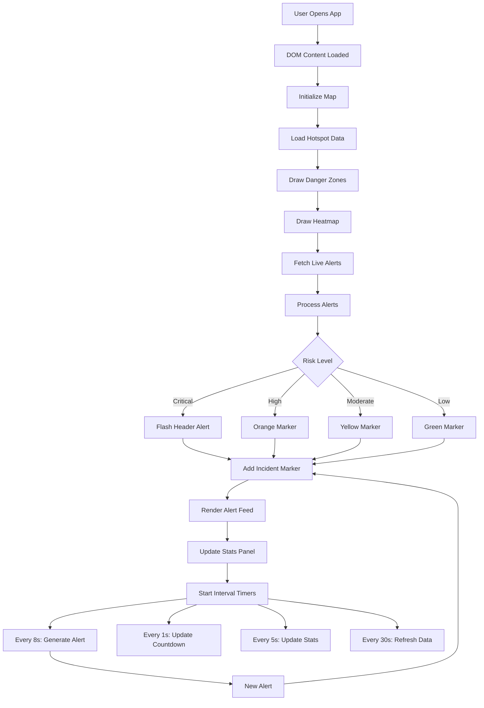

# BengalLive — Bengal Election Live Tracker

A real-time election live tracking application for West Bengal, India. Designed to help citizens stay informed about danger zones, traffic disruptions, and potential conflicts during the May 4th, 2026 election results day.

https://jicoing.github.io/bengallive/

## Features

- **Interactive Map** — Leaflet-powered map showing risk zones across West Bengal
- **Heatmap Visualization** — Visual density of incidents and danger areas
- **Live Alert Feed** — Real-time alerts aggregated from multiple sources (Reddit, Twitter, Traffic, Police, News)
- **Risk Zones** — Color-coded zones (Critical, High, Moderate, Safe) with radius indicators
- **Emergency Contacts** — Quick access to police, ambulance, fire, and emergency numbers
- **Safer Corridors** — Recommended routes to avoid conflicts
- **Areas to Avoid** — Known high-risk locations to stay away from
- **Countdown Timer** — Days/hours until election results are announced

## Tech Stack

- **HTML5** — Semantic markup
- **CSS3** — Custom styling with CSS variables, glassmorphism effects
- **JavaScript (ES6+)** — Vanilla JS with Leaflet.js mapping library
- **Leaflet.js** — Open-source mobile-friendly mapping library
- **Leaflet Heat** — Heatmap plugin for visualization
- **Live API Integration** — Fetches real-time data from multiple social sources

## Getting Started

1. Clone or download the repository
2. Open `index.html` in your browser
3. The application will automatically fetch live data

No build steps or server required — runs directly in the browser. It is fully compatible with static hosting like GitHub Pages.

## Project Structure

```
bengalelections/
├── index.html     # Main HTML file
├── app.js         # Application logic and state management
├── style.css     # Styles and theming
└── README.md     # This file
```

## Data Sources

The application aggregates live data from:
- **Reddit** — Real-time posts from r/kolkata and related subreddits
- **Twitter/X** — Live tweets with #BengalElections and related hashtags
- **Traffic APIs** — Real-time traffic and road closure data
- **Police Feeds** — Official law enforcement updates
- **News APIs** — Breaking news from local and national media

## Hotspot Locations

20+ predefined hotspot locations across West Bengal with risk assessments based on:
- Historical political violence data
- Current ground reports
- Election commission zone classifications

## Flow Diagram



### Flow Explanation

1. **Initialization** — App loads, initializes Leaflet map with dark theme tiles
2. **Hotspot Loading** — 20+ locations loaded with risk assessments
3. **Visualization** — Danger zones rendered as colored circles, heatmap layer added
4. **Alert Generation** — Timed intervals generate/refresh alerts every 8 seconds
5. **User Interaction** — Clicking alerts zooms map, filtering by source, toggling layers

## License

MIT License
